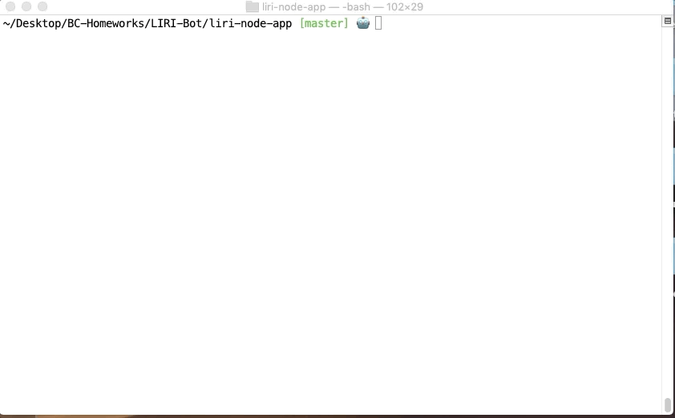

# liri-node-app

## Directions on how to use the liri-node-app
A node liri app! LIRI (language interpretation and recognition interface) is a command line node app that takes in parameters and gives back data. The following commands are available and surfaced in terminal for the user when the 'liri.js' is called to in the terminal: 

1. **concert-this** : input = artist name; output =  upcoming event information
2. **spotify-this-song** : input = song name; output = information on artists/ album
3. **movie-this** : input = movie name; output =  movie information 
4. **do-what-it-says** : input = 'random txt' file in the form of ("command",input); output = execution of the command specified in input

## Gifs of App
Command: concert-this

Command: spotify-this-song

Command: movie-this

Command: do-what-it-says

## Technologies Used
1. HTML 
2. CSS
4. Javascript
5. jQuery
6. AJAX/ API calls*
7. Node**

*APIs used: 
1. OMDB API
2. Bands In Town API
3. Spotify API

**NPM External Packages used: 
1. Moment
2. Node-Spotify-API 
3. Chalk

## Author(s): [Minori Hashimoto](https://github.com/minori-fh)